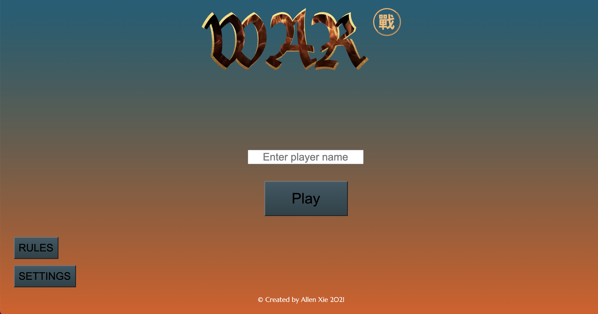

# War

  

## Description

War is a card game where two players compete to collect all 52 cards of the deck. Each player initially receives 26 cards and must play the next card on top of their deck each round. The player with the higher card takes both cards into their deck. 
  

## Technologies Used

- HTML
- CSS
- CSS Cardstarter Library
- JavaScript
- jQuery
  

## Getting Started

<a href="https://allenaxie.github.io/War/" target="_blank" rel="noreferrer noopener">Click here to play!</a>

- To start the game, enter your player name then click the 'Play' button.
- Each round, both players play the next card from the the top of their deck onto the field. The player with the higher ranking card takes both cards into their deck. Winner is declared when a player collects all 52 cards. 
- If both cards are of same rank, go to WAR; each player plays 4 more cards and the player with the higher ranking 4th card takes all the cards from the field into their deck. 

  

## Next Steps

- Add random computer trash talk lines
- Add chat box/system messages box
- Add settings option: player can use number of rounds before winner is declared
- Change background when WAR is declared
